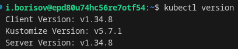
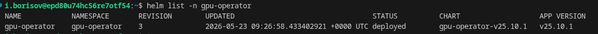
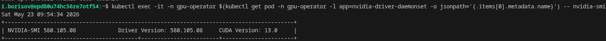
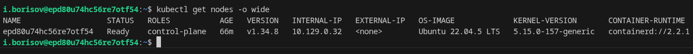
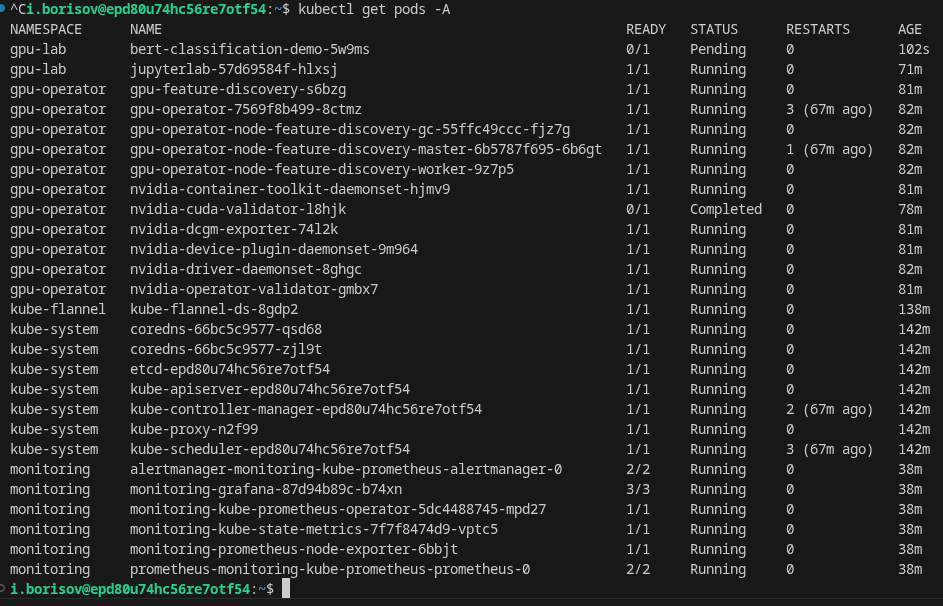
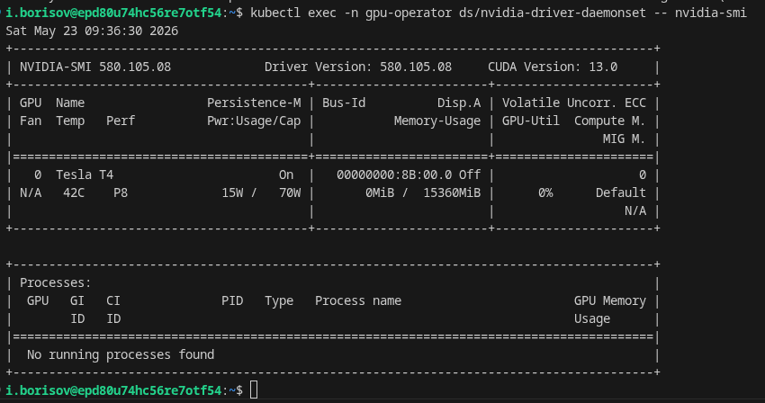
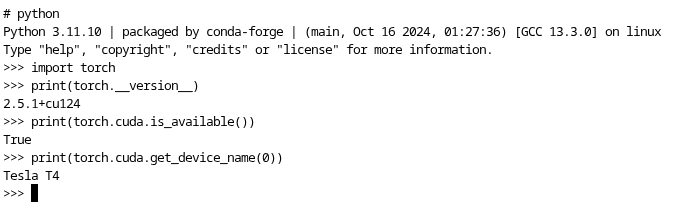
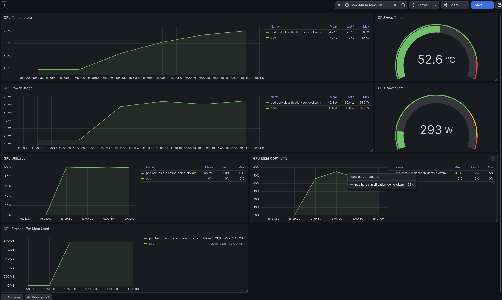
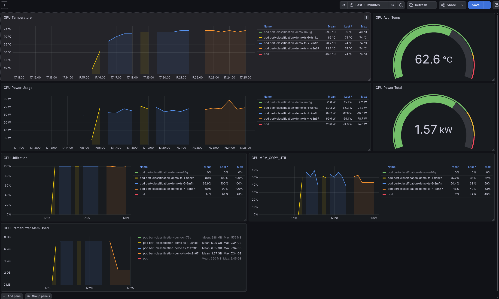

# Параметры VM и модель GPU
- OS: Ubuntu 22.04.05 LTS
- Capacity:
  - cpu:                8
  - ephemeral-storage:  100941264Ki
  - hugepages-1Gi:      0
  - hugepages-2Mi:      0
  - memory:             32861524Ki
  - nvidia.com/gpu:     1
  - pods:               110
- GPU: 1 NVIDIA T4 16GB VRAM

# Версии драйверов
### Kubernetes



### GPU Operator


### Драйвера NVIDIA и CUDA Driver API


### Драйвеа CUDA runtime
В образах используется версия cuda12.4
`image: pytorch/pytorch:2.5.1-cuda12.4-cudnn9-runtime`

# Скриншоты выполнения команд
### `kubectl get nodes -o wide;`


### `kubectl get pods -A;`



### вывод nvidia-smi из pod


### Терминал JupyterLab


# Запуски бенчей
Команда для запуска exclusive GPU 
```
helm install gpu-operator nvidia/gpu-operator \
  -n gpu-operator \
  --version=v25.10.1 \
  --set driver.enabled=true \
  --set driver.version=580.105.08 \
  --set toolkit.enabled=true \
  --set dcgmExporter.enabled=true \
  --set devicePlugin.config.name="" \
  --set devicePlugin.config.default=""
```

## Exclusive run

### Команда запуска
`kubectl apply -f manifests/transformers-bench.yaml`

### Grafana


### Время выполнения
`Training completed successfully in 190.38s!`

## Timeslicing run
Вручную ставим конфиг (по-другому не получилось)
```
cat <<EOF | kubectl apply -f -
apiVersion: v1
kind: ConfigMap
metadata:
  name: time-slicing-config
  namespace: gpu-operator
data:
  t4-timeslicing-4: |
    version: v1
    sharing:
      timeSlicing:
        renameByDefault: true
        failRequestsGreaterThanOne: true
        resources:
        - name: nvidia.com/gpu
          replicas: 4
EOF
```

### Команда запуска
```
NODE="$(kubectl get nodes -o jsonpath='{.items[0].metadata.name}')"
kubectl label node "$NODE" nvidia.com/device-plugin.config=t4-timeslicing-4 --overwrite
kubectl rollout restart -n gpu-operator daemonset/nvidia-device-plugin-daemonset
```

Run command:
```
for i in 1 2 3 4; do
  kubectl delete job -n gpu-lab --ignore-not-found "bert-classification-demo-ts-$i"
  sed "s/name: bert-classification-demo/name: bert-classification-demo-ts-$i/" \
    manifests/transformers-bench.yaml | kubectl apply -f -
done
```

### Grafana


Наблюдения:
- Куда-то пропал 3 ран (он шел в параллель с 1 и 2)
- 4 ран во время выполнения первых 3-х находился в pending
- Время работы каждой из джоб 460.3s, 485.10s, 481.31s, 157.62s (после выполнения первой джобы)

# Сравнение режимов использования GPU

## Таблица результатов

| Режим | Число pod | Kubernetes resource | Среднее время job (сек) | Пик GPU util | Пик FB used (GB) | Комментарий |
|-------|-----------|---------------------|-------------------|--------------|-------------|--------------|
| **Exclusive** | 1 | `nvidia.com/gpu` | 149.23 | 99% | 2.45 | 1 pod <--> 1 GPU => Все доступные ресурсы одной карточки |
| **Time-slicing** | 4 | `nvidia.com/gpu.shared` | ~387 | 100% | 7.34 | 3 рана отработали в параллель, 1 ожидал, выигрыша по времени нет |

**Вывод:** \
В данной задаче прироста выбить не получилось: если бы последовательно запускали 4 рана на них бы ушло по $\sim 150 \times 4 = \sim 600s$, когда на выполнение в time-slicing режиме на 4 джобы ушло суммарно $470+157 = \sim 637s$.

# Ответы на вопросы

1. Почему в exclusive одна job быстрее?  
Потому что GPU полностью принадлежит одной задаче. Нет деления ресурсов, нет очередей и прочих накладных ресурсов.

2. Почему в time-slicing можно запустить несколько pod на одной GPU?
Потому что GPU быстро переключается между задачами во времени среди подов. 

3. Какие риски при разделении одной GPU?  
- Cuda OOM убьет все задачи 
- Время выполнения каждой задачи сильно растет (см. сравнительную таблицу)  
- Задачи "мешают" друг другу  -- общая память, кэш

4. Чем MPS отличается от time-slicing?  
Time-slicing делит по времени, переключая задачи целиком.  
MPS же делит GPU на потоки одновременно -- ядра и память используются совместно, без переключений контекста. 

5. Какой режим вы бы выбрали?
- JupyterLab -> Exclusive  
- Batch-задача -> Time-slicing  
